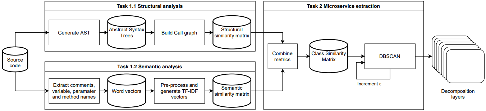

# A Hierarchical DBSCAN Method for Extracting Microservices from Monolithic Applications

The method used in this paper consists of two major steps:
1. Similarity Analysis: which contains two parts:
    - Structural Analysis: In this part, a Structural Similarity Matrix is built from the AST of the source code.
    - Semantic Analysis: In this part, a Semantic Similarity Matrix is built from the word vectors made from the source code.
2. Microservice Extraction: In this step, the matrices from step 1 are combined to give a Class Similarity Matrix, which is fed to the DBSCAN clustering algorithm to generate decomposition layers.




# How to Use

1. Make sure you have Java installed and the `java` command is available.
2. Make sure that `numpy`, `nltk` and `scikit-learn` are installed:
```
python -m pip install numpy nltk scikit-learn
```
3. Make sure you are in the _A_Hierarchical_DBSCAN_Method_ folder.
4. Run `main.py` with python with the required arguemnts:
```
python main.py source_code_path alpha minimum_number_of_sample max_epsilon
```
for example:
```
python main.py ../Test_Projects/jpetstore/OneFileSource.java 0.5 1 0.6
```
