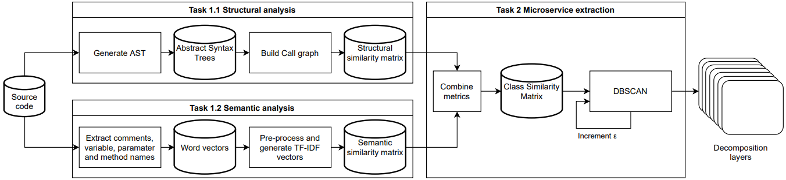

# A Hierarchical DBSCAN Method for Extracting Microservices from Monolithic Applications

The method used in this paper consists of two major steps:
1. Similarity Analysis: which contains two parts:
    - Structural Analysis: In this part, a Structural Similarity Matrix is built from the AST of the source code.
    - Semantic Analysis: In this part, a Semantic Similarity Matrix is built from the word vectors made from the source code.
2. Microservice Extraction: In this step, the matrices from step 1 are combined to give a Class Similarity Matrix, which is fed to the DBSCAN clustering algorithm to generate decomposition layers.




# How to Use

1. Make sure you have Java installed and the `java` command is available.
2. Install python requirements:
```
python -m pip install -r requirements.txt
```
3. import it in your code and use it:
```
# example.py

from HDBSCAN.main import hierarchical_DBSCAN

source_file_path = "path/to/source.java"
alpha = 0.5
min_samples = 2
max_epsilon = 0.7

layers, classes_info = hierarchical_DBSCAN(
        source_file_path, alpha, min_samples, max_epsilon)

```


## Acknowledgement

This is an unofficial implementation of [A hierarchical DBSCAN method for extracting microservices from monolithic applications](https://arxiv.org/pdf/2206.07010)

- https://dl.acm.org/doi/abs/10.1145/3530019.3530040
